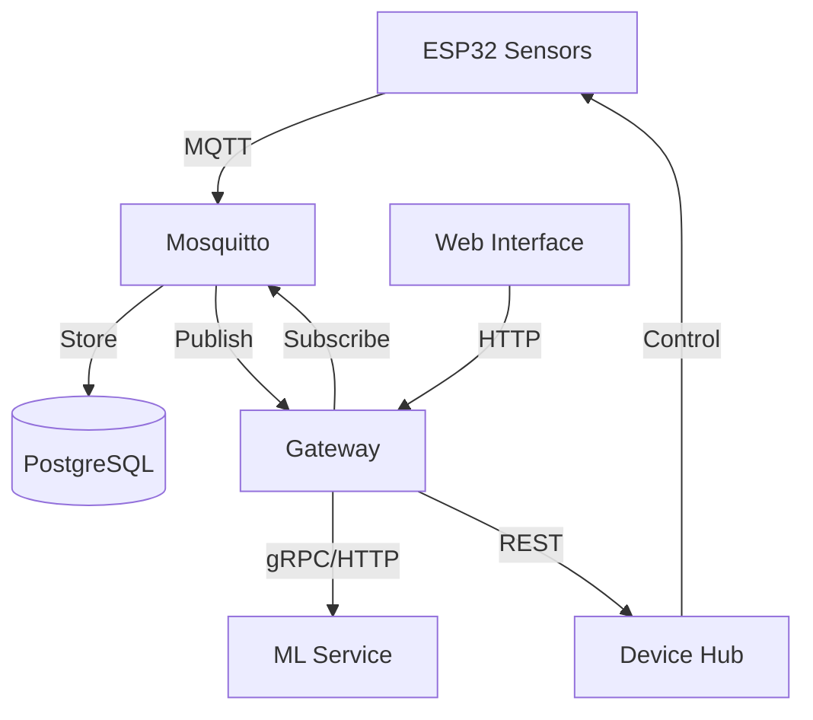

# 🌊 Aquea - Open Water Reclamation System

[](https://github.com/MKWorldWide/Aquea/actions)
[](https://github.com/MKWorldWide/Aquea/actions)
[](https://github.com/MKWorldWide/Aquea/blob/main/License.md)
[](https://www.python.org/)
[](https://www.docker.com/)

### ⚡ AI-Powered • 🔓 Open Source • 🌍 Global Impact

💧 **Bring clean water to everyone** with an open, verifiable, and scalable stack that spans from sensor to cloud:

🔌 **Firmware** → 🌐 **Edge** → ☁️ **Cloud** → 🤖 **AI/ML**

## ✨ Features

- **🔐 Integrity-first**: Every record is cryptographically chained via our pluggable hashing adapter (NessHash-ready)
- **📦 Monorepo simplicity**: All services, infrastructure, and hardware in one place
- **⚡ Fast start**: 🐳 Docker-first workflows with included simulator
- **🔧 Hackable**: Clear interfaces, type-safe models, and readable code
- **🌱 Sustainable**: Designed for low-power operation with solar capabilities
- **🔍 Verifiable**: End-to-end data integrity with blockchain-inspired ledger

## 🚀 Quick Start

### Prerequisites

- Docker and Docker Compose
- Python 3.11+
- Git

### Local Development

```bash
# 1) Clone the repository
git clone https://github.com/MKWorldWide/Aquea.git
cd Aquea

# 2) Set up environment
cp .env.example .env

# 3) Start the stack
docker compose up --build

# 4) In another terminal, start the simulator
docker compose run --rm simulator python publisher.py

# 5) Verify the system is running
curl http://localhost:8080/health
```

## 📚 Documentation

For detailed documentation, please visit our [documentation site](https://mkworldwide.github.io/aquea/).

- [Getting Started](https://mkworldwide.github.io/aquea/getting-started/installation/)
- [Architecture](https://mkworldwide.github.io/aquea/architecture/overview/)
- [API Reference](https://mkworldwide.github.io/aquea/api/gateway/)
- [Development Guide](https://mkworldwide.github.io/aquea/development/setup/)

## 🏗️ System Architecture



## 🛠️ Development

### Prerequisites

- Python 3.11+
- Poetry (recommended)
- Node.js 18+ (for frontend development)

### Setup

```bash
# Install Python dependencies
poetry install

# Install pre-commit hooks
pre-commit install

# Run tests
pytest

# Start development servers
make dev
```

## 🤝 Contributing

We welcome contributions! Please see our [Contributing Guidelines](https://mkworldwide.github.io/aquea/contributing/guidelines/) for details.

## 📄 License

This project is licensed under the MIT License - see the [LICENSE](License.md) file for details.

## 🙏 Acknowledgments

- [FastAPI](https://fastapi.tiangolo.com/)
- [Pydantic](https://pydantic-docs.helpmanual.io/)
- [MkDocs Material](https://squidfunk.github.io/mkdocs-material/)
- [Docker](https://www.docker.com/)

---

<p align="center">
  Made with ❤️ by <a href="https://mkworldwide.io">MK Worldwide</a>
</p>
           └──────────────┘            └──────────────┘
                  ╲
                   ╲ Hash Chain (NessHash adapter)
                    ╲
                 ┌────────┐
                 │Ledger  │
                 └────────┘
```

- **Topic**: `aquea/site/{site_id}/device/{device_id}/measurement`
- **Payload (example)**:

```json
{
  "ts": "2025-08-13T17:00:00Z",
  "site_id": "demo-site",
  "device_id": "esp32-01",
  "sensors": { "ph": 7.2, "tds_ppm": 190.3, "turbidity_ntu": 1.1, "temp_c": 22.4, "flow_lpm": 3.2, "pressure_kpa": 210.0 },
  "meta": { "firmware": "0.1.0" }
}
```

---

## 📁 Project Structure

```
/services
  /gateway         # 🚪 FastAPI ingestion + integrity ledger (NessHash-integrated)
  /device-hub      # 🔌 MQTT consumer → Postgres
  /ml-service      # 🧠 Anomaly scoring (placeholder → autoencoder/MPC)
  /simulator       # 🧪 MQTT publisher for demo payloads
/libs
  /nesshash-adapter  # 🔗 Pluggable hashing interface
/infra
  /db/init.sql     # 🗄️ Tables + indices
  /mqtt            # 📡 Mosquitto config
/hardware
  /kicad           # 📐 Schematics/PCB placeholders
  /firmware/esp32  # 🔧 PlatformIO skeleton (placeholder)
/docs              # 📝 Architecture & guides (published via Pages)
```

---

## 🔗 NessHash Integration (Data Integrity)

- **Adapter entry**: `libs/nesshash-adapter/nesshash_adapter/__init__.py::hash_record(payload, prev_hash)`
- **Switch backend**: set `NESSHASH_BACKEND=nesshash` to prefer your `nesshash` library if installed; falls back to BLAKE2b otherwise.

---

## 🛠️ System Health & API Endpoints

- **Gateway**: `GET /health`, `POST /ingest`, `GET /latest/{site_id}/{device_id}`
- **ML Service**: `GET /health`, `POST /predict`

Quick check:

```bash
curl http://localhost:8080/latest/demo-site/esp32-sim-01
```

---

## 📜 License Information

- **Code**: AGPL-3.0-or-later
- **Hardware**: CERN-OHL-S-2.0

See `LICENSES/` and file headers with `SPDX-License-Identifier`.

---

## 🤝 Join Our Community

We welcome NGOs, researchers, makers, and civic hackers. See [`CONTRIBUTING.md`](CONTRIBUTING.md).

---

## 🗺️ Development Roadmap (v0.1)

### 🎯 Current Focus

🔄 **In Progress**
- [ ] 🧪 Baseline sensors: pH, TDS, turbidity, temperature, flow, pressure
- [ ] 🔗 Ingestion + integrity ledger (NessHash)

### 🚧 Up Next
- [ ] 🤖 Anomaly detection (simple stats → autoencoder)
- [ ] 🎛️ Local control loop (PID) with safe bounds
- [ ] 🔌 Open hardware Rev A (KiCad) + BOM
- [ ] 🎚️ Calibration & QA procedures
- [�] 🏗️ Deployment recipes (Pi + ESP32; solar option)

- [ ] Baseline sensors: pH, TDS, turbidity, temperature, flow, pressure
- [ ] Ingestion + integrity ledger (NessHash)
- [ ] Anomaly detection (simple stats → autoencoder)
- [ ] Local control loop (PID) with safe bounds
- [ ] Open hardware Rev A (KiCad) + BOM
- [ ] Calibration & QA procedures
- [ ] Deployment recipes (Pi + ESP32; solar option)
